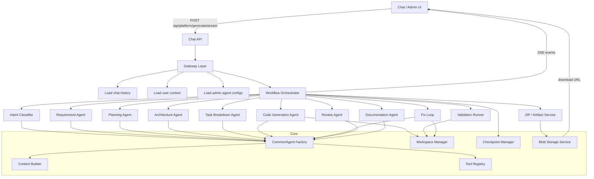

# AI Coding Platform Architecture

Production-grade project generation using **FastAPI**, **Microsoft Agent Framework (MAF)**, and **Azure Blob Storage**. All agent roles are **configuration-driven** via a single `CommonAgent` factory — no hardcoded `PlannerAgent` / `CodeAgent` classes.

---

## 1. Architecture Diagram



**Directed workflow (not group chat):** each stage runs sequentially (MVP) with checkpoints, retries, and structured JSON handoffs between agents.

---

## 2. Database Schema

| Table | Purpose |
|-------|---------|
| `platform_agent_configs` | Admin-defined agents: prompts, models, tools, retry policy |
| `platform_tool_configs` | Registered tools and permissions |
| `platform_workflow_configs` | Intent → ordered stages JSON |
| `platform_workflow_runs` | User runs, status, tokens, artifact URL |
| `platform_agent_runs` | Per-stage agent I/O and token usage |
| `platform_checkpoints` | Stage snapshots + workspace metadata |
| `platform_project_files` | Optional persisted file contents |
| `platform_execution_logs` | Streamed log persistence |
| `platform_artifacts` | ZIP metadata and blob URLs |

Migration: `alembic/versions/018_ai_platform.py`

---

## 3. FastAPI Folder Structure

```
Orbit_API/app/
├── api/v1/
│   ├── public/ai_platform.py      # POST /platform/generate/stream, runs, download
│   └── control/platform_config.py # Admin CRUD for agents/tools/workflows
├── models/ai_platform.py
├── schemas/ai_platform.py
└── services/ai_platform/
    ├── gateway.py                 # Chat history + orchestrator entry
    ├── stream.py                  # SSE + isolated DB session
    ├── types.py
    ├── common_agent/factory.py    # CommonAgent + CommonAgentFactory
    ├── context/builder.py
    ├── checkpoint/manager.py
    ├── workflow/orchestrator.py
    ├── workspace/manager.py
    ├── artifacts/blob_service.py
    ├── stores/config_store.py
    ├── stores/run_store.py
    ├── seeds/defaults.py
    └── tools/
        ├── registry.py
        ├── file_tools.py
        ├── command_tools.py
        ├── validation_tools.py
        ├── security_tools.py
        └── zip_tools.py
```

---

## 4. CommonAgent Factory Design

```python
CommonAgentFactory.from_db_row(PlatformAgentConfig) -> CommonAgent
```

- **One class** for all roles (`intent_classifier`, `code_generation`, `fix`, …)
- Config fields: `name`, `system_prompt`, `model_provider`, `model_name`, `temperature`, `max_tokens`, `tools`, `retry_policy`
- `run_json()` enforces JSON output with repair retries
- MAF `Agent` wrapper for future tool-calling integration; LangChain model is config-specific (cheap model for classification, strong for codegen)

---

## 5. Tool Registry Design

`ToolRegistry.execute(tool_name, **kwargs)` maps admin tool names to Python handlers:

| Tool | Handler |
|------|---------|
| `file_writer` | Write/update workspace files |
| `file_reader` | Safe path-scoped reads |
| `file_tree` | Directory listing |
| `command_runner` | Sandboxed subprocess (blocked dangerous commands) |
| `patch_apply` | Replace/delete patches |
| `dependency_analyzer` | package.json / requirements.txt |
| `code_search` | Workspace grep |
| `zip_tool` | Create ZIP with excludes |
| `validation` | npm/pip build pipeline |
| `security_scan` | Secret pattern scan |

Tools are assigned per agent in `platform_agent_configs.tools` (admin panel).

---

## 6. Workflow Orchestrator Design

`WorkflowOrchestrator.run_project_generation()`:

1. Create workspace + workflow run
2. Run intent classifier (checkpoint)
3. Load workflow config for intent
4. For each stage in `stages_json`:
   - **Agent stages:** ContextBuilder → CommonAgent → checkpoint
   - **write_files:** persist generated files
   - **validation:** run build + fix loop (max 3)
   - **artifact:** metadata for ZIP excludes
5. Create ZIP → upload Blob → return URL

Special stages skipped in loop: `intent_classification`, `fix`, `upload` (handled inline).

---

## 7. Context Builder Design

Token-aware sections per stage:

- User prompt (always)
- Structured JSON from prior stages (requirements, plan, architecture, tasks)
- File tree (not full repo)
- File previews only for validation/fix/review
- Truncated error logs for fix stage
- Max tree lines: 120; max error chars: 6000

---

## 8. Checkpoint Manager Design

After every major stage:

- Persist `checkpoint_data` (agent JSON output)
- Write workspace snapshot metadata to `{workspace}/.checkpoints/{stage}.json`
- Store `retry_count` for fix attempts

Enables resume/replay and audit trails.

---

## 9. SSE Event Design

Events streamed via `POST /api/platform/generate/stream`:

| Event | When |
|-------|------|
| `workflow_started` | Run created |
| `agent_started` | Stage begins |
| `agent_completed` | Stage JSON done |
| `file_created` | Files written |
| `command_log` / `command_failed` | Validation output |
| `fix_started` | Fix loop attempt |
| `checkpoint_created` | (optional) |
| `zip_created` | ZIP built |
| `completed` | Blob URL + summary |
| `error` | Fatal failure |

Payload shape: `{ type, stage, agent?, message, payload? }`

---

## 10. Admin Configuration Design

**Control Center API** (`/api/control/platform/`):

- `GET/POST/PATCH /agents` — prompts, models, tools per role
- `GET /tools` — registered tools
- `GET/POST/PATCH /workflows` — stage order, fix limits, human approval flag

Defaults seeded from `seeds/defaults.py` on first access.

Environment:

```env
AI_PLATFORM_WORKSPACE_DIR=data/ai_platform/workspaces
AI_PLATFORM_ARTIFACT_DIR=data/ai_platform/artifacts
AZURE_STORAGE_CONNECTION_STRING=...
AZURE_STORAGE_CONTAINER=orbit-artifacts
```

---

## 11. Security Checklist

- [x] Workspace path sandboxing (no escape outside root)
- [x] Blocked command fragments (`rm -rf /`, `sudo`, pipe-to-bash, etc.)
- [x] Command timeout (120s default)
- [x] ZIP excludes: `node_modules`, `.env`, `.git`, `dist`, `.next`
- [x] Pre-ZIP security scan for secret patterns
- [ ] Docker-isolated command execution (MVP uses subprocess in workspace cwd)
- [ ] Redis-backed SSE pub/sub for multi-instance
- [ ] Human approval gate before ZIP (config flag exists, wiring pending)
- [ ] ZIP size limit enforcement (`ai_platform_max_zip_bytes`)

---

## 12. Token Optimization Strategy

1. Never send full repo — file tree + summaries first
2. Structured JSON handoffs between stages (stored in DB)
3. Cheaper models for intent/requirements/planning
4. Strong models for architecture/code/fix
5. Fix loop sends truncated build logs only
6. Patch-based fixes instead of full regeneration
7. Template seeding (`nextjs_basic`, `fastapi_react`, …) reduces boilerplate tokens
8. No multi-agent group chat history
9. Batch file generation in code stage
10. Checkpoint summaries instead of re-sending all prior outputs

---

## 13. MVP Implementation Roadmap

### Done (this PR)
- [x] DB models + migration 018
- [x] CommonAgent factory + default seed configs
- [x] Tool registry + workspace/validation/zip/blob services
- [x] Directed workflow orchestrator with fix loop
- [x] SSE API: `/api/platform/generate/stream`
- [x] Admin config API: `/api/control/platform/*`
- [x] Local artifact fallback + download endpoint

### Next
- [ ] Frontend project generation UI (EventSource + log panel)
- [ ] Docker sandbox for `command_runner`
- [ ] Parallel file generation (frontend/backend/devops groups)
- [ ] Human-in-the-loop approval before ZIP
- [ ] Redis log pub/sub for horizontal scaling
- [ ] OpenTelemetry + Azure Monitor
- [ ] Background worker (Celery) for long runs
- [ ] Resume from checkpoint after failure
- [ ] Integrate with Clovops code workspace IDE

### Production
- [ ] Rate limits + token quotas per plan
- [ ] Template marketplace in admin
- [ ] Signed blob URLs with expiry
- [ ] Full security scan (bandit, npm audit, detect-secrets)

---

## API Quick Start

```bash
# Apply migration
cd Orbit_API && alembic upgrade head

# Generate project (SSE)
curl -N -X POST http://localhost:8000/api/platform/generate/stream \
  -H "Cookie: orbit_chat_session=..." \
  -H "Content-Type: application/json" \
  -d '{"prompt":"Build a modern portfolio website"}'
```

Download locally stored ZIP:

```
GET /api/platform/artifacts/download/{filename}
```
