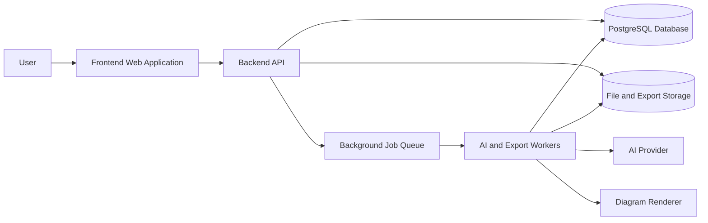
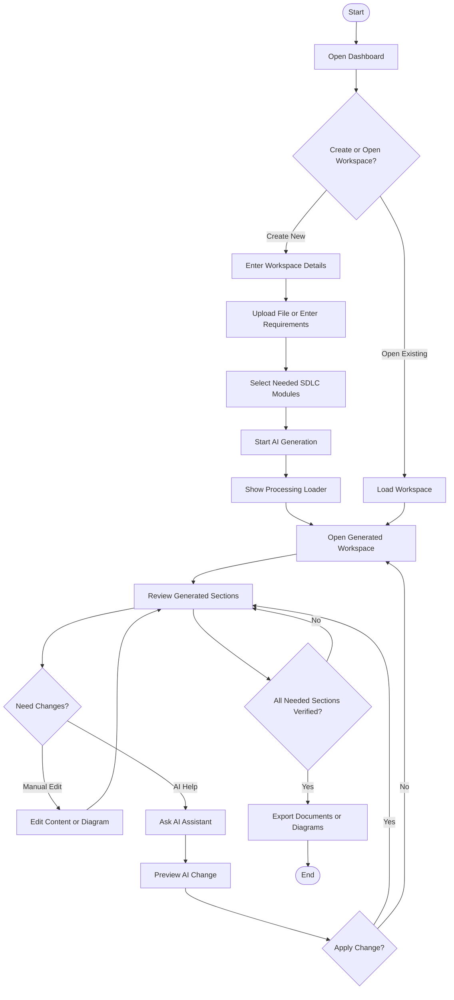
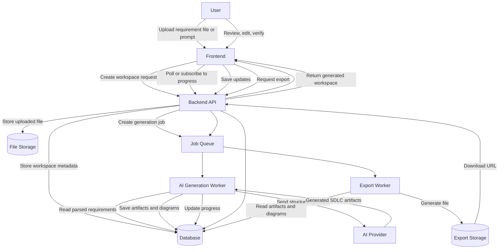
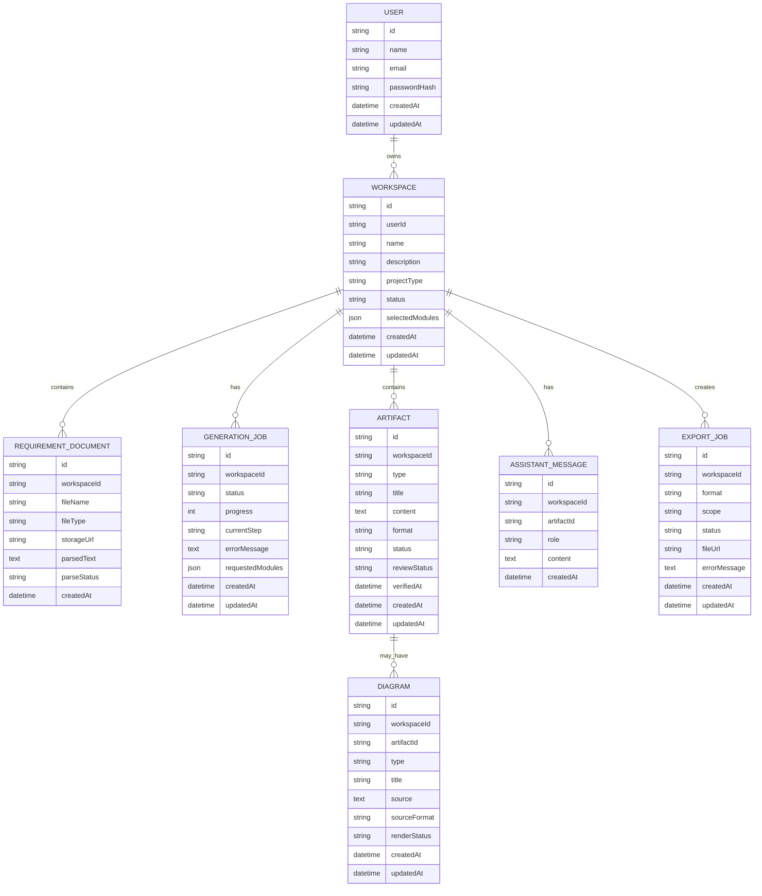
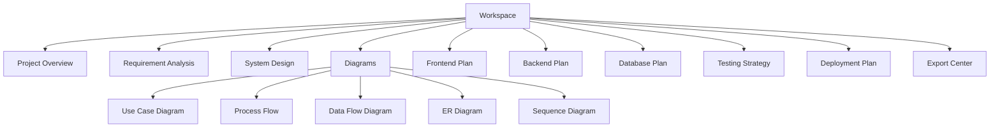
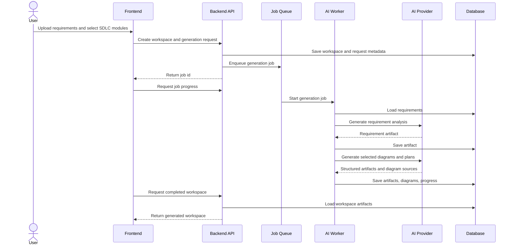

# Architecture, Diagrams, and Roadmap

## 1. System Context



## 2. Main User Process Flow



## 3. Data Flow Diagram



## 4. Entity Relationship Diagram



## 5. Workspace Module Structure



## 6. AI Generation Sequence



## 7. Recommended Project Structure

### Frontend

```text
frontend/
  src/
    app/
    components/
      workspace/
      artifacts/
      diagrams/
      assistant/
      export/
    hooks/
    lib/
    services/
    stores/
    types/
```

### Backend

```text
backend/
  src/
    modules/
      auth/
      workspaces/
      documents/
      generation/
      artifacts/
      diagrams/
      assistant/
      exports/
    common/
    database/
    queue/
    storage/
    ai/
```

## 8. Implementation Roadmap

### Phase 1: Foundation

- Set up frontend and backend projects.
- Add authentication.
- Add workspace CRUD.
- Add database schema.
- Add basic dashboard and workspace creation UI.

### Phase 2: Requirement Input

- Add file upload.
- Add manual requirement entry.
- Add document parsing.
- Add SDLC module selection.
- Add generation progress UI.

### Phase 3: AI Generation

- Add background job queue.
- Generate requirement analysis first.
- Add selected module generation.
- Save generated artifacts.
- Add retry for failed generation.

### Phase 4: Workspace Editing

- Build artifact editor.
- Add diagram rendering.
- Add review and verification statuses.
- Add save and update flows.

### Phase 5: AI Assistant

- Add assistant chat panel.
- Add artifact-aware prompts.
- Add preview before applying AI changes.
- Add regenerate section flow.

### Phase 6: Export System

- Export complete workspace.
- Export selected sections.
- Export diagrams as PNG and SVG.
- Add PDF, HTML, Markdown, and DOCX exports.

### Phase 7: Production Readiness

- Add role-based access if needed.
- Add monitoring and logs.
- Add input validation and file security.
- Add rate limiting.
- Add automated tests.
- Add deployment pipeline.

## 9. Minimum Viable Product

The MVP should include:

- User login
- Create workspace
- Upload or enter requirements
- Select SDLC sections
- Generate requirement analysis, diagrams, frontend plan, backend plan, and testing plan
- Edit generated artifacts
- Use AI assistant on one selected artifact
- Export complete workspace as PDF or Markdown

## 10. Suggested First Version Scope

To build quickly, start with these SDLC outputs:

- Project overview
- Functional requirements
- Non-functional requirements
- Use cases
- Process flow diagram
- ER diagram
- Frontend plan
- Backend plan
- API plan
- Testing plan

Then add advanced diagrams, team collaboration, version history, and third-party integrations later.
